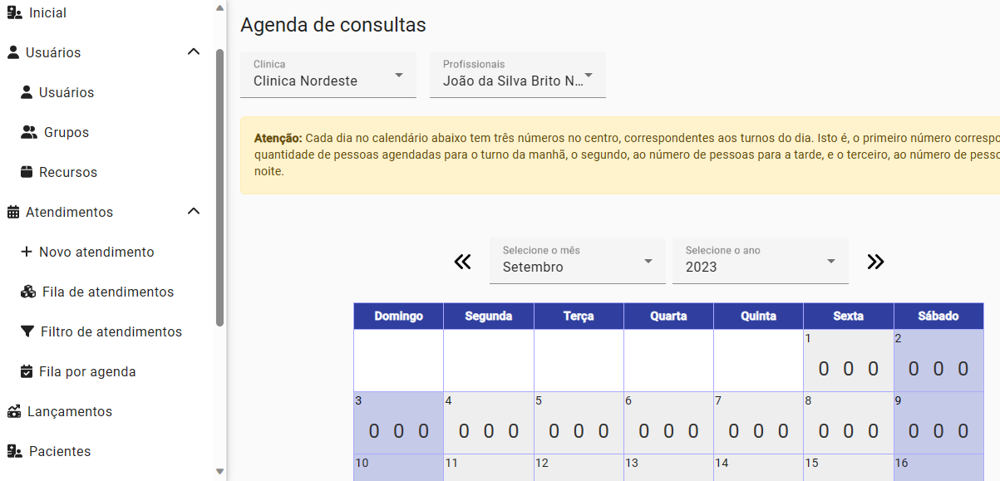
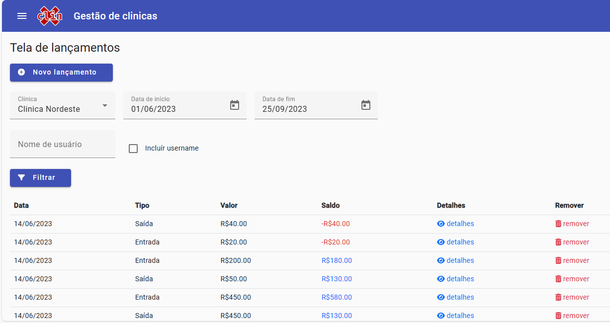
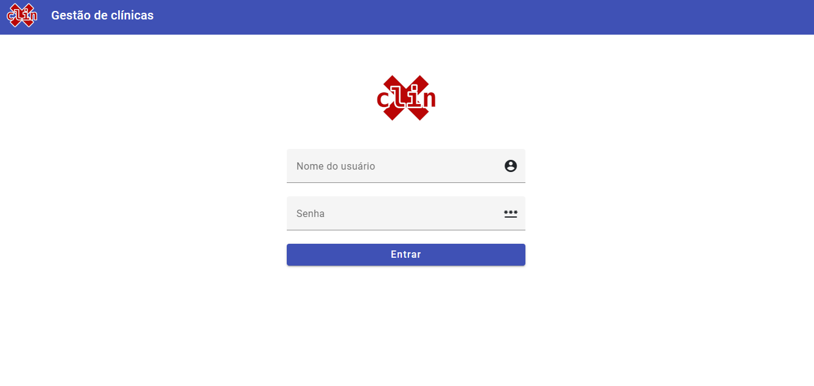

# XCLIN - Sistema para Clínicas Médicas

O XCLIN foi feito para suprir as necessidades de automação de clínicas médicas ou odontológicas. 

O sistema tem suporte a controle e agendamento de consultas, exames e procedimentos que podem ser vinculados a um profissional, data e turno de atendimento. 

O XCLIN também suporta controle de fluxo de caixa, bem como, usuários e restrição de acesso pelo perfil e cadastro e utilização de dados de clínicas, pacientes, usuários, recepcionistas, profissionais, diretores, etc.

# Algumas capturas de tela do sistema





# Rodando o sistema

O sistema foi feito com uso das seguintes tecnologias:

* Java 17
* Spring Boot 3.x
* Angular 15
* Angular Material
* PostgreSQL 15.2

Foram utilizadas também as seguintes tecnologias:

* Spring Tool Suite 4
* VSCode
* npm
* mvn

## O banco de dados

Para fazer o sistema funcionar é necessário criar e popular o banco de dados. Para isso, esteja certo de ter em seu computador o PostgreSQL Server 15.2 em execução e o cliente PSQL acessível pela linha de comandos e, então, execute o seguinte:

```
psql -U postgres
create database xclin;
\c xclin	
  ```

Feito isso, estando ainda na pasta raiz do projeto, procure pelo arquivo "xclin.sql". Esse arquivo deve ser importado para popular o banco de dados criado com nome "xclin".

```
\i xclin.sql
```

Ou faça o seguinte:

```
psql -U postgres xclin < xclin.sql
```
Agora o banco de dados já deve estar criado e você pode rodar o aplicativo "java/spring boot"!

## Rodando o backend

Para rodar o backend spring boot, você pode abrir o projeto clonado no Spring Tool Suite e executar o projeto por ele, ou utilizar o mvn ou o binário mvnw presente na pasta raiz do 
projeto. Aqui vamos utilizar o "mvnw". Então faça o seguinte: ainda com o terminal aberto na pasta raiz do projeto, certifique-se de estar na mesma pasta que o arquivo "mvnw" e então execute o comando abaixo para buildar/construir o projeto:

```
mvnw clean package -DskipTests
```

Feito isso, o war da aplicação deve estar na pasta "target". Então navegue ate a pasta target e procure pelo arquivo: "xclin.war". Ao encontrá-lo, execute o seguinte comando:

```
java -jar xclin.war
```
Isso irá executar o backend do projeto. Verifique o log do spring boot e, se tudo correr bem, falta apenas executar o frontend!

## Rodando o frontend

Para rodar o frontend Angular 15, basta navegar pelo terminal até a pasta frontend, presente na raiz do projeto e utilizar o comando "npm" para instalar as dependências:

```
npm install
```

E após as dependências instaladas, executar:

```
ng serve
```

Um proxy foi configurado para que o sistema fique acessível através da seguinte url:

http://localhost:4200

# Abrindo a tela de login

Para abrir a tela de login acesse o seguinte endereço:

```
http://localhost:4200
```

Deve aparecer a seguinte tela:



# Os usuários e senhas já registrados

Entre no formulário de login com um dos seguintes usuários:

```
Usuário: italo
Senha: 0758it
Perfil: Usuário Raiz

Usuário: maria
Senha: maria0748
Perfil: Recepcionista

Usuário: profissional
Senha: prof0748
Perfil: Profissional de saúde

Usuário: admin
Senha: admin0748
Perfil: Usuário Administrador

Usuário: diretor
Senha: diretor0748
Perfil: Diretor
```

Agora é só acessar o sistema e testar!
